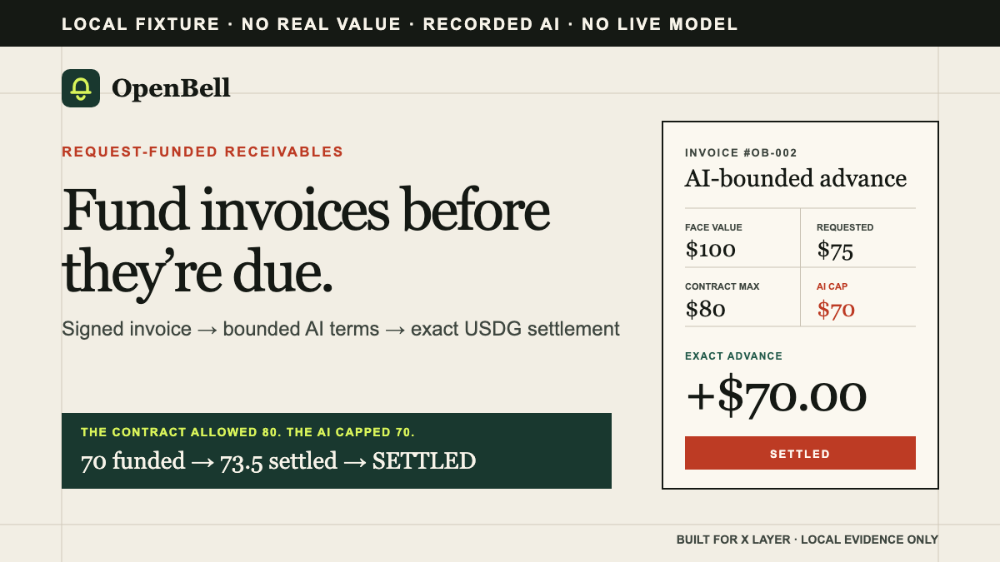

# OpenBell

**Bounded invoice funding on X Layer.**

OpenBell turns a payer-signed invoice into exact USDG funding. A genuine AI underwriter may approve
less or refuse, but it never holds funds. OpenBell binds the resulting decision to the invoice and
funder; X Layer rejects any underwriter-signed advance above the immutable contract limit and preserves
the funding and settlement trail.

[Live app](https://openbell.dolepee.com/) · [Try OpenBell](https://openbell.dolepee.com/studio/#try) ·
[Live desk](https://openbell.dolepee.com/mainnet/) · [Proof room](https://openbell.dolepee.com/proof/)



## Mainnet result

One complete canonical-USDG lifecycle reached `SETTLED` on X Layer mainnet:

| Stage | Result |
| --- | --- |
| Supplier request | `0.05 USDG` |
| Genuine model decision | `REJECT` · first response · no retry |
| Disclosed human exception | Maximum `0.025 USDG` |
| Contract execution | Exactly `0.025 USDG` funded |
| Final settlement | Exactly `0.02525 USDG` repaid |

The human exception did not replace or relabel the model refusal. It committed to the original
rejected artifact and could authorize only the stricter of 25% of face value or 50% of the original
request.

### Five X Layer receipts

| # | Action | Mainnet transaction |
| --- | --- | --- |
| 1 | Register dual-signed invoice | [`0x4d3363…67948`](https://www.okx.com/web3/explorer/xlayer/tx/0x4d33630813698f2bbdee3e6adf386128efa6c7aee9d775edc83c22c0b7667948) |
| 2 | Authorize exactly `0.025 USDG` | [`0x822b0f…4412f`](https://www.okx.com/web3/explorer/xlayer/tx/0x822b0fa4ddf74c77e9b6beb31d3c0ebe5955568c1f33426a8558ef47e934412f) |
| 3 | Fund exactly `0.025 USDG` | [`0xf17ef4…ab35a`](https://www.okx.com/web3/explorer/xlayer/tx/0xf17ef4753d4e89f6b25e62978e3e46600850b7457a7af4383618c0dbc1eab35a) |
| 4 | Authorize exactly `0.02525 USDG` | [`0x8fda8d…de6fb`](https://www.okx.com/web3/explorer/xlayer/tx/0x8fda8d63338694e5705ce537991d7be410f209b076300ae515006408d77de6fb) |
| 5 | Settle exactly `0.02525 USDG` | [`0xdd8e68…658e5`](https://www.okx.com/web3/explorer/xlayer/tx/0xdd8e682a7cc7342f11e355567ccb8c99e32b926287f85ed111cbfa8d273658e5) |

## Product loop

```text
signed invoice
    -> receipt-bound AI assessment
    -> smallest authorized USDG advance
    -> direct payer settlement
```

1. **Sign the receivable.** Supplier and payer sign identical invoice terms and a local document
   hash through EIP-712.
2. **Assess confirmed history.** OpenBell derives payer history from confirmed X Layer contract
   events across both official RPCs. Supplier-declared performance is not accepted.
3. **Fund exact terms.** A funder advances only the smallest amount allowed by the request, model,
   and immutable contract ceiling.
4. **Settle directly.** The payer repays the fixed amount to the recorded funder and the invoice
   reaches terminal state `SETTLED`.

## Why the AI is load-bearing

The model produces one structured, invoice-bound decision. It may:

- lower the permitted advance;
- increase the required fee within the contract ceiling; or
- refuse and emit no executable terms.

The first valid response is authoritative and is not retried or substituted. The model cannot change
the signed invoice, custody funds, bypass party signatures, exceed contract ceilings, or execute a
transaction.

The mainnet assessment used a receipt-derived checkpoint through X Layer block `68,230,450`:

- `1` completed settlement, on time;
- `0` open funded invoices;
- `71.42%` counterparty concentration; and
- byte-identical observations from both official X Layer RPCs.

That limited, concentrated history produced the genuine result:

```text
REJECT · LIMITED HISTORY · HIGH CONCENTRATION · NO RETRY
```

[Inspect the sanitized decision](evidence/openbell-receipt-bound-rejection.json) ·
[Inspect the checkpoint](evidence/openbell-receipt-bound-history-baseline.json)

## Why X Layer is load-bearing

X Layer is not only the deployment destination. The chain provides the facts the model evaluates and
enforces the economic boundary afterward:

- confirmed OpenBell receipts become the underwriting history;
- chain ID `196` and the deployed EIP-712 domain bind every signature;
- canonical USDG is transferred with exact balance-delta accounting;
- invoice state prevents duplicate funding and stale execution; and
- public receipts prove the advance, repayment, and terminal state.

Remove X Layer and OpenBell loses both its receipt-derived risk history and its settlement authority.

## Try OpenBell

The shortest product path requires no wallet. Open the
[one-click trial](https://openbell.dolepee.com/studio/#try) and select **Prepare the no-wallet credit memo**.
OpenBell runs the real browser-side preparation engine, calculates the immutable contract limit,
creates the invoice ID and document commitment, and renders an inspectable unsigned package and credit
memo. The sample is explicitly testnet/no-value and makes no model, signature, financing, or transaction
claim.

| Surface | Purpose | Wallet required |
| --- | --- | --- |
| [`/studio/`](https://openbell.dolepee.com/studio/#try) | Run the one-click sample or prepare invoice terms, hash a document locally, and export an unsigned package | No |
| [`/mainnet/`](https://openbell.dolepee.com/mainnet/) | Continue the supplier, payer, underwriter, funder, or settlement workflow | Only for the relevant role |
| [`/fund/`](https://openbell.dolepee.com/fund/) | Complete one exact invited funding action when a verified candidate is available | Funder only |
| [`/proof/`](https://openbell.dolepee.com/proof/) | Inspect deployment, model, lifecycle, and evidence boundaries | No |

The dedicated one-wallet funding route has also been completed by an unrelated tester without a file,
CLI, or founder transaction for that action. Wallet `0x2Ef353…05244` funded exactly `0.005 USDG` in
[`0xa9068a…e030a`](https://www.okx.com/web3/explorer/xlayer/tx/0xa9068afbd10fec26550883b7d52018623d7b184ad8cbdb310099a547526e030a).
Independence is an offchain attestation; the wallet, transfer, and `REGISTERED -> FUNDED` transition
are onchain-verifiable. This does not claim independent completion of every role in the full lifecycle.

## Deployment

| Field | Value |
| --- | --- |
| Network | X Layer mainnet · chain `196` |
| Contract | [`0xc4Ef249b80a6a034198C226278c51b0a903840dd`](https://www.okx.com/web3/explorer/xlayer/address/0xc4Ef249b80a6a034198C226278c51b0a903840dd) |
| Settlement token | Canonical USDG · `0x4ae46a509F6b1D9056937BA4500cb143933D2dc8` |
| Deployment transaction | [`0x328c80…af413e`](https://www.okx.com/web3/explorer/xlayer/tx/0x328c80d5c4e5a7a13c3143f1f3c5667f83823c3ebdfbd3ca1d9c07b7f3af413e) |
| Deployment block | `67,764,503` |
| Runtime hash | `0x3aa05fd1a2f966e99324c8c24dc3ee67e2f4c11a4f3c8de0da25fc1f7e8a9798` |

The contract is non-custodial and request-funded. It has no pool, protocol token, auction, secondary
market, governance system, collections engine, partial funding, or partial repayment. Only a document
hash is placed onchain.

## Security boundary

`OpenBellReceivables.sol` uses:

- EIP-712 domain separation and ERC-1271-compatible signature checks;
- exact ERC-20 balance-delta accounting;
- replay, duplicate-funding, stale-decision, and wrong-party protection;
- reentrancy protection;
- immutable advance and fee ceilings;
- rotatable underwriting authority; and
- an originations-only pause that does not block settlement of funded invoices.

OpenBell proves signed terms, bounded decisions, exact token movement, and contract state. It does not
prove legal validity of an offchain invoice, guarantee repayment, establish broad market demand, or
claim that every lifecycle role was independently operated.

## Run locally

Requirements: Node.js, npm, and Foundry.

```bash
npm ci
npm run check
```

For the local website:

```bash
npm run web:check
npm run web:serve
```

Open `http://127.0.0.1:4187`.

## Evidence

- [Pre-lifecycle mainnet deployment snapshot](evidence/openbell-xlayer-mainnet-deployment.json)
- [Reproducible deployment verification](evidence/openbell-xlayer-mainnet-verification-record.json)
- [Mainnet lifecycle observations](evidence/openbell-xlayer-mainnet-lifecycle-observations.json)
- [Deterministic lifecycle verification](evidence/openbell-xlayer-mainnet-lifecycle-verification.json)
- [Receipt-bound history observations](evidence/openbell-receipt-bound-history-observations.json)
- [Receipt-bound genuine rejection](evidence/openbell-receipt-bound-rejection.json)
- [Independent one-wallet funder observations](evidence/openbell-independent-cold-funder-observations.json)
- [Deterministic one-wallet funder verification](evidence/openbell-independent-cold-funder.json)

The labelled X Layer testnet fixture remains available for reproducible testing under `/operate/` and
in the evidence archive. It is explicitly separate from the canonical-USDG mainnet lifecycle above.
